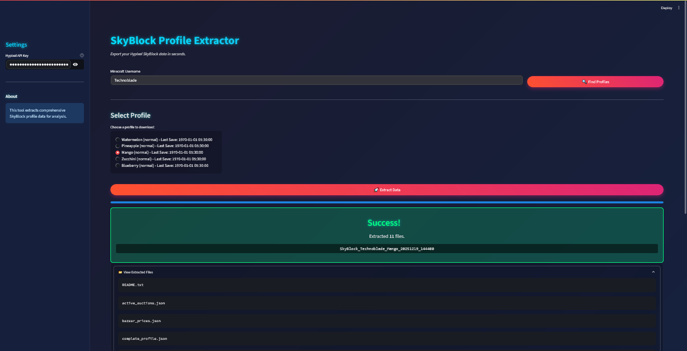

<div align="center">
  
  <h1>SkyBlock Profile Extractor</h1>
  <p><strong>Effortlessly extract comprehensive Hypixel SkyBlock profile data via the Official API.</strong></p>

  <a href="https://github.com/Sahaj33-op/SkyBlock-Profile-Extractor/stargazers"></a>
  <a href="https://github.com/Sahaj33-op/SkyBlock-Profile-Extractor/blob/main/LICENSE"></a>
  <a href="https://www.python.org/"></a>
  <a href="https://streamlit.io/"></a>
</div>

---

## ✨ Overview

**SkyBlock Profile Extractor** is a powerful, user-friendly tool designed to fetch and organize raw, comprehensive data from your Hypixel SkyBlock profiles. Whether you're a dedicated player looking to analyze your networth, track progression, or feed data into AI tools for optimization strategies — this tool has you covered.

Built with reliability in mind, it interfaces directly with the **Official Hypixel API v2**, ensuring accurate and up-to-date information.

<p align="center">
  
  <br/>
  <em>The modern Streamlit-based GUI for seamless data extraction.</em>
</p>

---

## 🚀 Key Features

| Feature                 | Description                                                                 |
| :---------------------- | :-------------------------------------------------------------------------- |
| **Complete Profile**    | Inventories, Skills, Slayers, Dungeons, Collections, Vault, Wardrobe, etc. |
| **Garden Data**         | Farming stats, plot upgrades, and visitor information.                     |
| **Museum Data**         | Donated items, appraisals, and special collectibles.                       |
| **Guild Data**          | Detailed guild information, ranks, and member lists.                       |
| **Economy Insights**    | Live Bazaar prices and active Auction House listings.                      |
| **Player Status**       | Online status, recent games, and global Hypixel stats.                     |
| **& More**              | Fire Sales, Bingo Data, SkyBlock News...                                   |

---

## 📦 Installation

### Prerequisites

1.  **Python 3.8+**: [Download Python](https://www.python.org/downloads/)
2.  **Hypixel API Key**: Obtain yours from the [Hypixel Developer Dashboard](https://developer.hypixel.net/).
3.  **SkyBlock API Access**: Enable it in-game via `SkyBlock Menu` → `Settings` → `API Settings`.

### Steps

```bash
# Clone the repository
git clone https://github.com/Sahaj33-op/SkyBlock-Profile-Extractor.git
cd SkyBlock-Profile-Extractor

# Install dependencies
pip install requests streamlit

# Run the GUI
streamlit run app.py
```

> [!TIP]
> For a quick command-line extraction, you can also run `python extract_profile.py` or `.\extract-profile.ps1` (Windows PowerShell).

---

## 🖥️ Usage

1.  **Launch the App**: Run `streamlit run app.py`.
2.  **Enter API Key**: Paste your Hypixel API key in the sidebar. It will be saved locally for future use.
3.  **Enter Username**: Type in the Minecraft username of the player.
4.  **Select Profile**: Choose from the available SkyBlock profiles.
5.  **Extract**: Click the button and watch the magic happen!

All data is saved into a timestamped directory: `SkyBlock_<Username>_<Profile>_<Timestamp>/`.

---

## 📂 Output Files

| File                     | Contents                                                     |
| :----------------------- | :----------------------------------------------------------- |
| `complete_profile.json`  | The holy grail — contains nearly all player-specific data.   |
| `garden_data.json`       | Detailed Garden and farming statistics.                      |
| `museum_data.json`       | Museum collection and appraisal data.                        |
| `bazaar_prices.json`     | Current Bazaar market data for networth calculations.        |
| `player_data.json`       | Global Hypixel statistics for the player.                    |
| `guild_data.json`        | Guild information (if applicable).                           |

---

## 🧠 AI-Powered Analysis

Leverage the power of Large Language Models (like ChatGPT or Claude) to analyze your extracted data.

**Example Prompt:**

> Analyze my `complete_profile.json` file. Using the item values from `bazaar_prices.json`, calculate my approximate total networth and identify my most valuable items. Suggest 3 areas I should focus on for progression.

---

## 🤝 Contributing

Contributions are welcome! Please see [`CONTRIBUTING.md`](CONTRIBUTING.md) for guidelines on how to get involved.

---

## 📄 License

This project is licensed under the **MIT License**. See the [`LICENSE`](LICENSE) file for details.

---

<div align="center">
  <sub>Built with ❤️ by <a href="https://github.com/Sahaj33-op">Sahaj33-op</a>. Not affiliated with Hypixel Inc.</sub>
</div>
